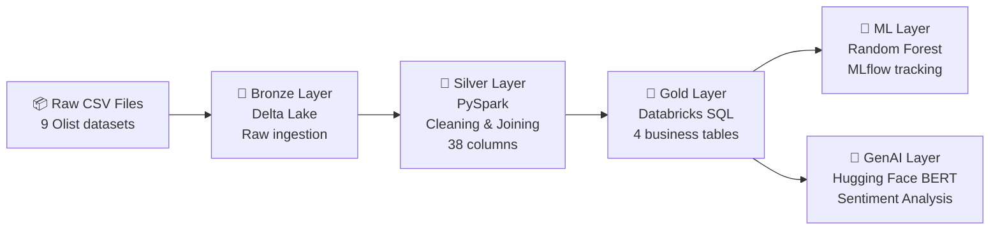

# Pipeline Architecture

## Data flow

| Layer | Tool | Input | Output |
|---|---|---|---|
| Bronze | Delta Lake | 9 CSV files | 9 raw Delta tables |
| Silver | PySpark | 9 Delta tables | 1 master table, 38 columns |
| Gold | Databricks SQL | Master table | 4 aggregation tables |
| ML | MLflow + Scikit-learn | Gold data | Review score predictor |
| GenAI | Hugging Face | Review text | Sentiment labels |
